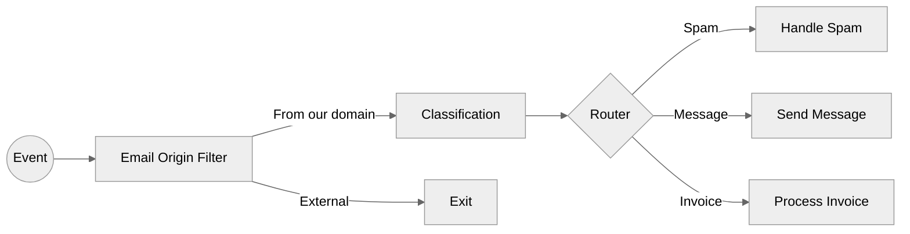

## Workflow Definition



## Email Example Data

```json
[
  {
    "subject": "You won a free iPhone – Claim Now!",
    "body": "Congratulations! You've been selected to receive a brand new iPhone. Click this link to claim your reward: http://scammyphish.biz/claim"
  },
  {
    "subject": "Meeting recap and action items",
    "body": "Hi team, here’s a quick summary of our meeting today. Let me know if I missed anything important. Next steps: finish the dashboard update by Friday."
  },
  {
    "subject": "Invoice for your recent purchase",
    "body": "Dear customer, please find attached the invoice #DATAL-384920 for your order placed on May 12th. Let us know if you have any questions."
  }
]
```